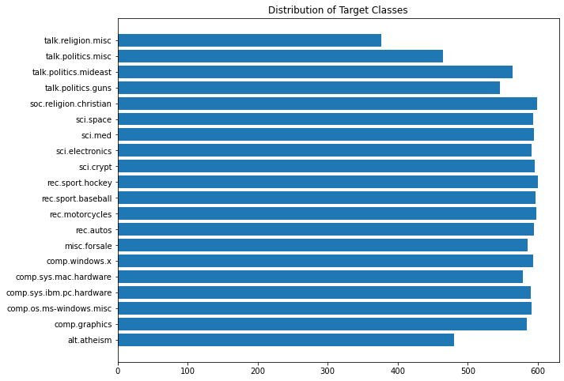

# NLP Codealong

<a id='eda'></a>

## EDA

As always, we want to look at the basic shape of the data.  

What form do we want the above dataframe to take? What does a row represent? What does a column represent?

Let's take a look at one record.  What type of preprocessing steps should we take to isolate tokens of high semantic value?

Answer here

## Frequency Distributions

Let's look at the frequency distribution of all the words in the corpus.  To do so, we will use the FreqDist class from nltk.  

The FreqDist methods expect to receive a list of tokens, so we need to do a little preprocessing. We will use the RegexpTokenizer from nltk.  

There are a few places in this notebook where regular expressions will prove useful. 

Let's look at this tool [regexr](https://regexr.com/) and try to figure out the very basic pattern to match any word.


```python
# Pass that pattern into our RegexpTokenizer

from nltk.probability import FreqDist
from nltk.tokenize import RegexpTokenizer 

rt = RegexpTokenizer(pattern = '\w+' )
```


```python
# Join all of the words 
all_docs = ' '.join(list(X_train[0]))
# use the rt object's tokenize method to create a list of all of the tokens
all_words = rt.tokenize(all_docs)
```


```python
# Instantiate a FreqDist object and pass allwords into it
fd = FreqDist(all_words)

# use the most_common method to see the 10 most common words
fd.most_common(10)
```


    [('the', 97520),
     ('to', 53636),
     ('of', 50724),
     ('a', 42974),
     ('AX', 41899),
     ('and', 41313),
     ('I', 39088),
     ('is', 31244),
     ('in', 29504),
     ('that', 27895)]


## Visualize the distribution of the target with a bar chart


```python
fig, ax = plt.subplots(figsize=(10,8))
counts = np.unique(y, return_counts=True)[0]
labels = np.unique(y, return_counts=True)[1]
ax.barh(counts, labels)
ax.set_yticks(range(0,len(data.target_names)))
ax.set_yticklabels(data.target_names)
ax.set_title('Distribution of Target Classes')
ax.set_ylabel;
```





## Quick Model

Our model validation principles are consistent with NLP modeling.   
We split our data in the same way, ideally with a hold out set.   


```python
from sklearn.model_selection import train_test_split
X_train, X_test, y_train, y_test = train_test_split(X, y, random_state=42)
```

## Count Vectorizor

A count vectorizor takes as input all of the documents in their raw form.  That being the case, if we are doing any preprocessing, such as custom transformations like lemming and stemming, we will need to recombine the tokens into the original documents.  

For our FSM, we will pass our documents into the vectorizer in their raw form.


```python
from nltk.corpus import stopwords

cv = CountVectorizer(stop_words=stopwords.words('english'), token_pattern='[a-zA-Z]+' )
```

### Question: 

Look at all those wonderful parameters.  What parameters would be useful to test out? 

Let's look at our regular expressions again, and add a better pattern.

[regexr](https://regexr.com/)

With our CountVectorizer, we apply the same principles of model validation as we have with other data.  Fit on the training set, and transform both the train and test with that fit object. This will create a vocabulary associated with high predictive value built off of the training vocabulary. 

### DataFrame from sparse and get feature names

As we see above, the fit_transform method returns a sparse matrix.  Luckily, our alogrithms will handle sparse matrices, as we will see below.  But, if we want, we can convert our sparse matrix to a fully expressed dataframe using the .from_spmatrix method taken from DataFrame.sparse


```python
X_train_vec = pd.DataFrame.sparse.from_spmatrix(cv.fit_transform(X_train[0]))
```


    ---------------------------------------------------------------------------

    AttributeError                            Traceback (most recent call last)

    <ipython-input-249-f0616dc35744> in <module>
          1 #__SOLUTION__
    ----> 2 X_train_vec = pd.DataFrame.sparse.from_spmatrix(cv.fit_transform(X_train[0]))
    

    AttributeError: 'NoneType' object has no attribute 'fit_transform'


We can also add the words as column names using cv.get_feature_names()


```python
# Add words as column names
X_train_vec.columns = cv.get_feature_names()
X_train_vec.head()
```


    ---------------------------------------------------------------------------

    AttributeError                            Traceback (most recent call last)

    <ipython-input-248-d1ce865e2d6d> in <module>
          1 #__SOLUTION__
          2 # Add words as column names
    ----> 3 X_train_vec.columns = cv.get_feature_names()
          4 X_train_vec.head()


    AttributeError: 'NoneType' object has no attribute 'get_feature_names'


As mentioned above, we don't necessarily need the feature names present to build our model.

Let's build a model with the count vectorizer from above, and use sklearns pipeline and cross_validate to see how accurately we can classify the documents.

We will apply a CountVectorizor and then a multinomial naive bayes classifier.


```python
from sklearn.pipeline import make_pipeline
from sklearn.naive_bayes import MultinomialNB
from sklearn.model_selection import cross_validate

# create a pipeline object 
fsm_pipe = make_pipeline(CountVectorizer(stop_words=stopwords.words('english'), token_pattern='[a-zA-Z]+' ), MultinomialNB() )
cross_validate(fsm_pipe, X_train[0], y_train, return_train_score=True, scoring='f1_micro')
```


    {'fit_time': array([1.31140304, 1.34622407, 1.32734108, 1.36256218, 1.2426579 ]),
     'score_time': array([0.28266478, 0.30783796, 0.31305885, 0.29179311, 0.26753926]),
     'test_score': array([0.83500295, 0.83500295, 0.83677077, 0.84855628, 0.84384207]),
     'train_score': array([0.93945197, 0.94210371, 0.9435769 , 0.93856806, 0.94446081])}


Now that we have a funcitonal pipeline, we have the framework to easily test out new parameters and models. Try n-grams, min_df/max_df, tfidf vectorizers, better token patterns.  Try Random Forests, XGBoost, and SVM's. The world is your oyster.


```python
'Random Forest did not perform very well'
from sklearn.ensemble import RandomForestClassifier
fsm_pipe = make_pipeline(CountVectorizer(stop_words=stopwords.words('english'), 
                                         token_pattern= "[a-zA-Z]+(?:'[a-z]+)?", 
                                         min_df=3, 
                                        max_df=10), RandomForestClassifier(n_estimators=10) )

cross_validate(fsm_pipe, X_train[0], y_train, return_train_score=True)
```


    ---------------------------------------------------------------------------

    KeyError                                  Traceback (most recent call last)

    ~/anaconda3/envs/learn-env/lib/python3.8/site-packages/sklearn/feature_extraction/text.py in _count_vocab(self, raw_documents, fixed_vocab)
       1111                 try:
    -> 1112                     feature_idx = vocabulary[feature]
       1113                     if feature_idx not in feature_counter:


    KeyError: 'dave'

    
    During handling of the above exception, another exception occurred:


    KeyboardInterrupt                         Traceback (most recent call last)

    <ipython-input-253-2fdbf2f96a16> in <module>
          7                                         max_df=10), RandomForestClassifier(n_estimators=10) )
          8 
    ----> 9 cross_validate(fsm_pipe, X_train[0], y_train, return_train_score=True)
    

    ~/anaconda3/envs/learn-env/lib/python3.8/site-packages/sklearn/utils/validation.py in inner_f(*args, **kwargs)
         70                           FutureWarning)
         71         kwargs.update({k: arg for k, arg in zip(sig.parameters, args)})
    ---> 72         return f(**kwargs)
         73     return inner_f
         74 


    ~/anaconda3/envs/learn-env/lib/python3.8/site-packages/sklearn/model_selection/_validation.py in cross_validate(estimator, X, y, groups, scoring, cv, n_jobs, verbose, fit_params, pre_dispatch, return_train_score, return_estimator, error_score)
        240     parallel = Parallel(n_jobs=n_jobs, verbose=verbose,
        241                         pre_dispatch=pre_dispatch)
    --> 242     scores = parallel(
        243         delayed(_fit_and_score)(
        244             clone(estimator), X, y, scorers, train, test, verbose, None,


    ~/anaconda3/envs/learn-env/lib/python3.8/site-packages/joblib/parallel.py in __call__(self, iterable)
       1046             # remaining jobs.
       1047             self._iterating = False
    -> 1048             if self.dispatch_one_batch(iterator):
       1049                 self._iterating = self._original_iterator is not None
       1050 


    ~/anaconda3/envs/learn-env/lib/python3.8/site-packages/joblib/parallel.py in dispatch_one_batch(self, iterator)
        864                 return False
        865             else:
    --> 866                 self._dispatch(tasks)
        867                 return True
        868 


    ~/anaconda3/envs/learn-env/lib/python3.8/site-packages/joblib/parallel.py in _dispatch(self, batch)
        782         with self._lock:
        783             job_idx = len(self._jobs)
    --> 784             job = self._backend.apply_async(batch, callback=cb)
        785             # A job can complete so quickly than its callback is
        786             # called before we get here, causing self._jobs to


    ~/anaconda3/envs/learn-env/lib/python3.8/site-packages/joblib/_parallel_backends.py in apply_async(self, func, callback)
        206     def apply_async(self, func, callback=None):
        207         """Schedule a func to be run"""
    --> 208         result = ImmediateResult(func)
        209         if callback:
        210             callback(result)


    ~/anaconda3/envs/learn-env/lib/python3.8/site-packages/joblib/_parallel_backends.py in __init__(self, batch)
        570         # Don't delay the application, to avoid keeping the input
        571         # arguments in memory
    --> 572         self.results = batch()
        573 
        574     def get(self):


    ~/anaconda3/envs/learn-env/lib/python3.8/site-packages/joblib/parallel.py in __call__(self)
        260         # change the default number of processes to -1
        261         with parallel_backend(self._backend, n_jobs=self._n_jobs):
    --> 262             return [func(*args, **kwargs)
        263                     for func, args, kwargs in self.items]
        264 


    ~/anaconda3/envs/learn-env/lib/python3.8/site-packages/joblib/parallel.py in <listcomp>(.0)
        260         # change the default number of processes to -1
        261         with parallel_backend(self._backend, n_jobs=self._n_jobs):
    --> 262             return [func(*args, **kwargs)
        263                     for func, args, kwargs in self.items]
        264 


    ~/anaconda3/envs/learn-env/lib/python3.8/site-packages/sklearn/model_selection/_validation.py in _fit_and_score(estimator, X, y, scorer, train, test, verbose, parameters, fit_params, return_train_score, return_parameters, return_n_test_samples, return_times, return_estimator, error_score)
        561         score_time = time.time() - start_time - fit_time
        562         if return_train_score:
    --> 563             train_scores = _score(estimator, X_train, y_train, scorer)
        564     if verbose > 2:
        565         if isinstance(test_scores, dict):


    ~/anaconda3/envs/learn-env/lib/python3.8/site-packages/sklearn/model_selection/_validation.py in _score(estimator, X_test, y_test, scorer)
        605         scores = scorer(estimator, X_test)
        606     else:
    --> 607         scores = scorer(estimator, X_test, y_test)
        608 
        609     error_msg = ("scoring must return a number, got %s (%s) "


    ~/anaconda3/envs/learn-env/lib/python3.8/site-packages/sklearn/metrics/_scorer.py in __call__(self, estimator, *args, **kwargs)
         88                                       *args, **kwargs)
         89             else:
    ---> 90                 score = scorer(estimator, *args, **kwargs)
         91             scores[name] = score
         92         return scores


    ~/anaconda3/envs/learn-env/lib/python3.8/site-packages/sklearn/metrics/_scorer.py in _passthrough_scorer(estimator, *args, **kwargs)
        370 def _passthrough_scorer(estimator, *args, **kwargs):
        371     """Function that wraps estimator.score"""
    --> 372     return estimator.score(*args, **kwargs)
        373 
        374 


    ~/anaconda3/envs/learn-env/lib/python3.8/site-packages/sklearn/utils/metaestimators.py in <lambda>(*args, **kwargs)
        117 
        118         # lambda, but not partial, allows help() to work with update_wrapper
    --> 119         out = lambda *args, **kwargs: self.fn(obj, *args, **kwargs)
        120         # update the docstring of the returned function
        121         update_wrapper(out, self.fn)


    ~/anaconda3/envs/learn-env/lib/python3.8/site-packages/sklearn/pipeline.py in score(self, X, y, sample_weight)
        605         Xt = X
        606         for _, name, transform in self._iter(with_final=False):
    --> 607             Xt = transform.transform(Xt)
        608         score_params = {}
        609         if sample_weight is not None:


    ~/anaconda3/envs/learn-env/lib/python3.8/site-packages/sklearn/feature_extraction/text.py in transform(self, raw_documents)
       1248 
       1249         # use the same matrix-building strategy as fit_transform
    -> 1250         _, X = self._count_vocab(raw_documents, fixed_vocab=True)
       1251         if self.binary:
       1252             X.data.fill(1)


    ~/anaconda3/envs/learn-env/lib/python3.8/site-packages/sklearn/feature_extraction/text.py in _count_vocab(self, raw_documents, fixed_vocab)
       1110             for feature in analyze(doc):
       1111                 try:
    -> 1112                     feature_idx = vocabulary[feature]
       1113                     if feature_idx not in feature_counter:
       1114                         feature_counter[feature_idx] = 1


    KeyboardInterrupt: 

