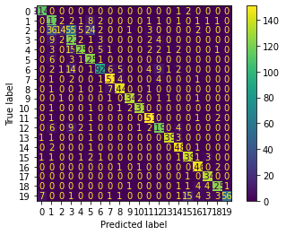

# NLP Codealong


```python
from src.student_caller import one_random_student
from src.student_list import quanggang
```


```python
from sklearn.datasets import fetch_20newsgroups

# Import our best friends
import pandas as pd
import numpy as np
import matplotlib.pyplot as plt
```


```python
data = fetch_20newsgroups()
data.keys()
```


    dict_keys(['data', 'filenames', 'target_names', 'target', 'DESCR'])


```python
data.target_names
```


    ['alt.atheism',
     'comp.graphics',
     'comp.os.ms-windows.misc',
     'comp.sys.ibm.pc.hardware',
     'comp.sys.mac.hardware',
     'comp.windows.x',
     'misc.forsale',
     'rec.autos',
     'rec.motorcycles',
     'rec.sport.baseball',
     'rec.sport.hockey',
     'sci.crypt',
     'sci.electronics',
     'sci.med',
     'sci.space',
     'soc.religion.christian',
     'talk.politics.guns',
     'talk.politics.mideast',
     'talk.politics.misc',
     'talk.religion.misc']


<a id='eda'></a>

## EDA

As always, we want to look at the basic shape of the data.  


```python
X = pd.DataFrame(data['data'])
X.shape
```


    (11314, 1)


```python
X.head()
```


<div>
<style scoped>
    .dataframe tbody tr th:only-of-type {
        vertical-align: middle;
    }

    .dataframe tbody tr th {
        vertical-align: top;
    }

    .dataframe thead th {
        text-align: right;
    }
</style>
<table border="1" class="dataframe">
  <thead>
    <tr style="text-align: right;">
      <th></th>
      <th>0</th>
    </tr>
  </thead>
  <tbody>
    <tr>
      <th>0</th>
      <td>From: lerxst@wam.umd.edu (where's my thing)\nS...</td>
    </tr>
    <tr>
      <th>1</th>
      <td>From: guykuo@carson.u.washington.edu (Guy Kuo)...</td>
    </tr>
    <tr>
      <th>2</th>
      <td>From: twillis@ec.ecn.purdue.edu (Thomas E Will...</td>
    </tr>
    <tr>
      <th>3</th>
      <td>From: jgreen@amber (Joe Green)\nSubject: Re: W...</td>
    </tr>
    <tr>
      <th>4</th>
      <td>From: jcm@head-cfa.harvard.edu (Jonathan McDow...</td>
    </tr>
  </tbody>
</table>
</div>


What form do we want the above dataframe to take? What does a row represent? What does a column represent?


```python
# your answer here
```


```python
one_random_student(quanggang)
```

    Jamie


Let's take a look at one record.  What type of preprocessing steps should we take to isolate tokens of high semantic value?


```python
X.iloc[3].values[0]
```


    'From: jgreen@amber (Joe Green)\nSubject: Re: Weitek P9000 ?\nOrganization: Harris Computer Systems Division\nLines: 14\nDistribution: world\nNNTP-Posting-Host: amber.ssd.csd.harris.com\nX-Newsreader: TIN [version 1.1 PL9]\n\nRobert J.C. Kyanko (rob@rjck.UUCP) wrote:\n> abraxis@iastate.edu writes in article <abraxis.734340159@class1.iastate.edu>:\n> > Anyone know about the Weitek P9000 graphics chip?\n> As far as the low-level stuff goes, it looks pretty nice.  It\'s got this\n> quadrilateral fill command that requires just the four points.\n\nDo you have Weitek\'s address/phone number?  I\'d like to get some information\nabout this chip.\n\n--\nJoe Green\t\t\t\tHarris Corporation\njgreen@csd.harris.com\t\t\tComputer Systems Division\n"The only thing that really scares me is a person with no sense of humor."\n\t\t\t\t\t\t-- Jonathan Winters\n'


Answer here


```python
one_random_student(quanggang)
```

## Frequency Distributions

Let's look at the frequency distribution of all the words in the corpus.  To do so, we will use the FreqDist class from nltk.  

The FreqDist methods expect to receive a list of tokens, so we need to do a little preprocessing. We will use the RegexpTokenizer from nltk.  

There are a few places in this notebook where regular expressions will prove useful. 

Let's look at this tool [regexr](https://regexr.com/) and try to figure out the very basic pattern to match any word.


```python
# Instantiate a RegexpTokenizer object and pass that pattern as the pattern argument

from nltk.probability import FreqDist
from nltk.tokenize import RegexpTokenizer 

rt = RegexpTokenizer()
```


    ---------------------------------------------------------------------------

    TypeError                                 Traceback (most recent call last)

    <ipython-input-196-d80686d9cfac> in <module>
          4 from nltk.tokenize import RegexpTokenizer
          5 
    ----> 6 rt = RegexpTokenizer()
    

    TypeError: __init__() missing 1 required positional argument: 'pattern'


```python
one_random_student(quanggang)
```


```python
# Join all of the words 
all_docs = ' '.join(list(X_train[0]))

# use the rt object's tokenize method to create a list of all of the tokens
all_words = None
```


```python
one_random_student(quanggang)
```


```python
# Instantiate a FreqDist object and pass allwords into it

# use the most_common method to see the 10 most common words

```


```python
one_random_student(quanggang)
```

## Visualize the distribution of the target with a bar chart


```python
y = data['target']
```


```python
# Target classes
data['target_names']
```


    ['alt.atheism',
     'comp.graphics',
     'comp.os.ms-windows.misc',
     'comp.sys.ibm.pc.hardware',
     'comp.sys.mac.hardware',
     'comp.windows.x',
     'misc.forsale',
     'rec.autos',
     'rec.motorcycles',
     'rec.sport.baseball',
     'rec.sport.hockey',
     'sci.crypt',
     'sci.electronics',
     'sci.med',
     'sci.space',
     'soc.religion.christian',
     'talk.politics.guns',
     'talk.politics.mideast',
     'talk.politics.misc',
     'talk.religion.misc']


```python
# Bar Chart Here (horizontal, preferably)
```


```python
one_random_student(quanggang)
```

    Jamie


## Quick Model

Our model validation principles are consistent with NLP modeling.   
We split our data in the same way, ideally with a hold out set.   


```python
# Train Test Split

```


```python
X_train[0]
```


    1513     From: DSHAL@vmd.cso.uiuc.edu\nSubject: Re: Cli...
    6814     From: david@stat.com (David Dodell)\nSubject: ...
    7846     From: mouse@thunder.mcrcim.mcgill.edu (der Mou...
    2980     From: chen@citr.uq.oz.au (G. Chen)\nSubject: H...
    6075     From: thor@surt.atd.ucar.edu (Richard E. Neitz...
                                   ...                        
    11284    Distribution: world\nFrom: elenay_creations@tc...
    5191     From: jnielsen@magnus.acs.ohio-state.edu (John...
    5390     From: keith@cco.caltech.edu (Keith Allan Schne...
    860      From: jake@bony1.bony.com (Jake Livni)\nSubjec...
    7270     From: smorris@venus.lerc.nasa.gov (Ron Morris ...
    Name: 0, Length: 8485, dtype: object


## Count Vectorizor

A count vectorizor takes as input all of the documents in their raw form.  That being the case, if we are doing any preprocessing, such as custom transformations like lemming and stemming, we will need to recombine the tokens into the original documents.  

For our FSM, we will pass our documents into the vectorizer in their raw form.


```python
from sklearn.feature_extraction.text import CountVectorizer

# instantiate a CountVectorizor object 
cv = None
```


```python
one_random_student(quanggang)
```

    Jamie


```python

```

### Question: 

Look at all those wonderful parameters.  What parameters would be useful to test out? 

Let's look at our regular expressions again, and add a better pattern.

[regexr](https://regexr.com/)


```python
# Instantiate a better CountVectorizer with stopwords, a regular expression pattern, and whatever else you would like  
```


```python
one_random_student(quanggang)
```

With our CountVectorizer, we apply the same principles of model validation as we have with other data.  Fit on the training set, and transform both the train and test with that fit object. This will create a vocabulary associated with high predictive value built off of the training vocabulary. 


```python
cv.fit_transform(X_train[0])
```


    <8485x79190 sparse matrix of type '<class 'numpy.int64'>'
    	with 981634 stored elements in Compressed Sparse Row format>


### DataFrame from sparse and get feature names

As we see above, the fit_transform method returns a sparse matrix.  Luckily, our alogrithms will handle sparse matrices, as we will see below.  But, if we want, we can convert our sparse matrix to a fully expressed dataframe using the .from_spmatrix method taken from DataFrame.sparse


```python
# convert the sparse matrix from above to a dataframe
X_train_vec = None
```


```python
one_random_student(quanggang)
```

We can also add the words as column names using cv.get_feature_names()


```python
# Add words as column names
```

As mentioned above, we don't necessarily need the feature names present to build our model.

Let's build a model with the count vectorizer from above, and use sklearns pipeline and cross_validate to see how accurately we can classify the documents.

We will apply a CountVectorizor and then a multinomial naive bayes classifier.


```python
# import make_pipeline
# import MultinomialNB
# import cross_validate

# create a pipeline object with our CountVectorizer and Multinomial Naive Bayes as our steps

# feed the pipeline into cross_validate along with X_train[0] and y_train
```


```python
one_random_student(quanggang)
```

    Christos


Now that we have a funcitonal pipeline, we have the framework to easily test out new parameters and models. Try n-grams, min_df/max_df, tfidf vectorizers, better token patterns.  Try Random Forests, XGBoost, and SVM's. The world is your oyster.


```python
# Of course, when we are finished tuning our model, we fit on the entire training set, and score on the test.
fsm_pipe.fit(X_train[0], y_train)
```


    Pipeline(steps=[('countvectorizer',
                     CountVectorizer(stop_words=['i', 'me', 'my', 'myself', 'we',
                                                 'our', 'ours', 'ourselves', 'you',
                                                 "you're", "you've", "you'll",
                                                 "you'd", 'your', 'yours',
                                                 'yourself', 'yourselves', 'he',
                                                 'him', 'his', 'himself', 'she',
                                                 "she's", 'her', 'hers', 'herself',
                                                 'it', "it's", 'its', 'itself', ...],
                                     token_pattern='[a-zA-Z]+')),
                    ('multinomialnb', MultinomialNB())])


```python
y_hat_test = fsm_pipe.predict(X_test[0])
```


```python
from sklearn.metrics import plot_confusion_matrix

plot_confusion_matrix(fsm_pipe,X_test[0], y_test)
```


    <sklearn.metrics._plot.confusion_matrix.ConfusionMatrixDisplay at 0x1ae449fd0>




